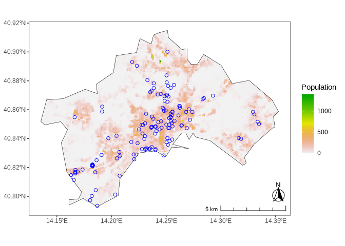
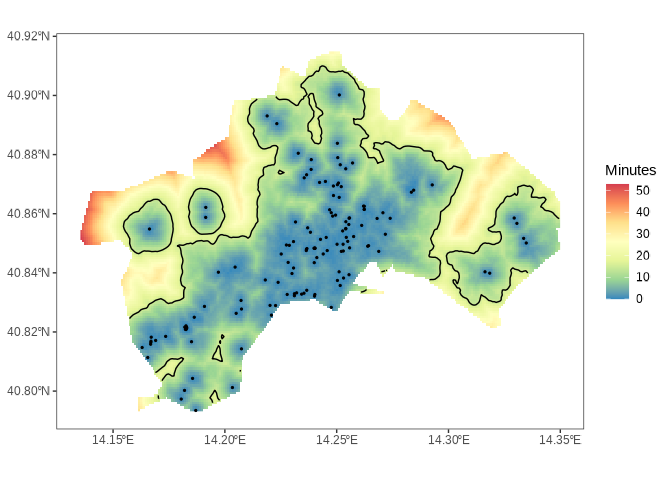
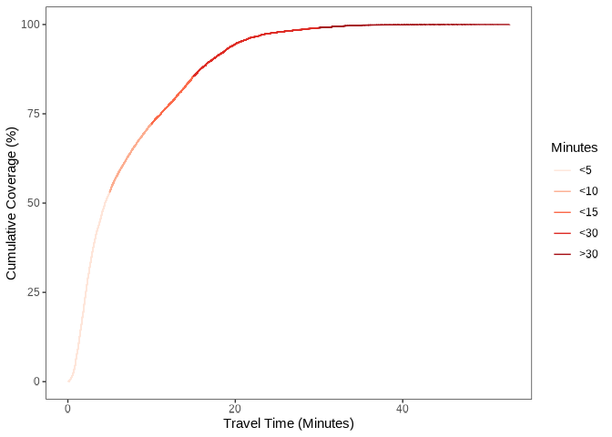
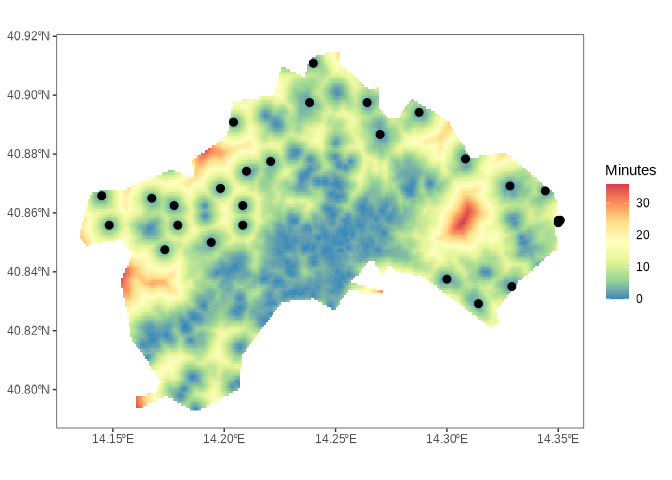
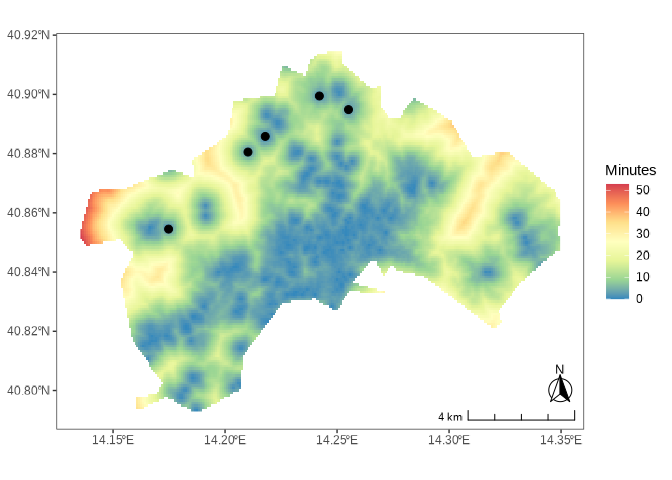
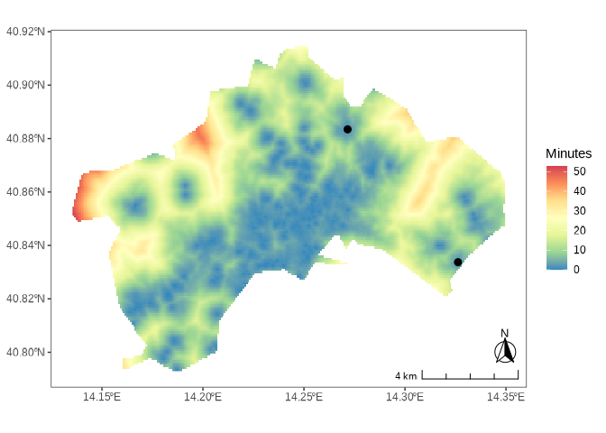
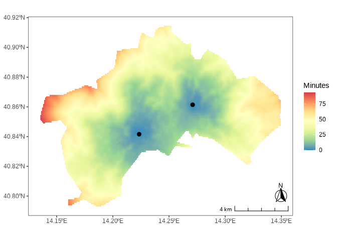

# locationallocation <a href = "https://giacfalk.github.io/locationallocation/"></a>

<!-- quarto render -->

<!-- badges: start -->
[](https://www.repostatus.org/#active)
[](https://doi.org/10.31223/X5XQ69)
[](https://github.com/giacfalk/locationallocation/actions)
[](https://www.gnu.org/licenses/gpl-3.0)
[](https://www.contributor-covenant.org/version/3/0/code_of_conduct/)
<!-- badges: end -->

## Overview

Assessing and planning infrastructure and service networks, given a
dispersed demand, limited capacity, accessibility targets, and concerns
about spatial justice, is a central policy challenge. Problems of this
type are commonly referred to as *Maximal Coverage Location-Allocation*
(MCLA) spatial optimization problems.

`locationallocation` is an R package that provides tools for solving
MCLA problems with geospatial data. It builds on widely used spatial
libraries in R, follows [tidyverse
principles](https://tidyverse.tidyverse.org/articles/manifesto.html),
and integrates seamlessly with the broader [tidyverse
ecosystem](https://tidyverse.org/). The package can generate
travel-time maps and optimize the placement of facilities or
infrastructure according to accessibility criteria, which can be
weighted by one or more variables or by a user-defined function.

Potential applications of the package extend to the domains of public
infrastructure assessment and planning (public services provision,
e.g. transport, social services, healthcare, parks), urban environmental
and climate risk reduction interventions, logistics and hubs allocation,
commercial and strategic decisions.

> If you find this project useful, please consider giving it a star!  
> [](https://github.com/giacfalk/locationallocation/)

## Installation

You can install `locationallocation` using the
[`remotes`](https://github.com/r-lib/remotes) package:

``` r
# install.packages(remotes)
remotes::install_github("giacfalk/locationallocation")
```

A [CRAN](https://cran.r-project.org/) version of the package is planned
for the near future.

## Usage

To use the package, start by loading it to your R session using the
`library` function:

``` r
library(locationallocation)
```

As an example, we demonstrate how the package can address urban-scale
climate risk through infrastructure assessment and geospatial planning.
For this demonstration, we use the demo datasets included with the
package.

These datasets include the coordinates of public drinking water
fountains (blue dots) in Naples, Italy
([`naples_fountains`](https://giacfalk.github.io/locationallocation/reference/naples_fountains.html));
a gridded population raster from the Global Human Settlement Layer
([GHSL](https://human-settlement.emergency.copernicus.eu)) Population
Grid
([GHS-POP](https://human-settlement.emergency.copernicus.eu/download.php?ds=pop))
([`naples_population`](https://giacfalk.github.io/locationallocation/reference/naples_population.html));
a 100-meter resolution heat hazard map, representing the number of days
with [Wet-Bulb Globe
Temperature](https://en.wikipedia.org/wiki/Wet-bulb_globe_temperature)
above 25°C during 2008–2017, obtained from the
[UrbClim](https://www.urban-climate.eu/model) model
([`naples_hot_days`](https://giacfalk.github.io/locationallocation/reference/naples_hot_days.html));
and the city’s administrative boundaries
([`naples_shape`](https://giacfalk.github.io/locationallocation/reference/naples_shape.html)).



We can use the
[`traveltime()`](https://giacfalk.github.io/locationallocation/reference/traveltime.html)
function to create a map of current accessibility to the facility points
(represented by the [`sf`](https://r-spatial.github.io/sf/) object
[`naples_fountains`](https://giacfalk.github.io/locationallocation/reference/naples_fountains.html))
within the specified geographical boundaries. The function allows the
user to select a travel mode (walking or fastest route) and an output
spatial resolution in meters, achieved through [dissevering spatial
downscaling techniques](https://doi.org/10.1016/j.cageo.2011.08.021).

``` r
traveltime_data <-
  naples_fountains |>
  traveltime(
    bb_area = naples_shape,
    dowscaling_model_type = "lm",
    mode = "walk",
    res_output = 100
  )
```

Once
[`traveltime()`](https://giacfalk.github.io/locationallocation/reference/traveltime.html)
has completed, the resulting layer can be visualized using the
[`traveltime_plot()`](https://giacfalk.github.io/locationallocation/reference/traveltime_plot.html)
function.

``` r
traveltime_data |>
  traveltime_plot(
    bb_area = naples_shape,
    facilities = naples_fountains,
    contour_traveltime = 15
  )
```



We can also generate a summary plot and compute statistics using the
output of the
[`traveltime()`](https://giacfalk.github.io/locationallocation/reference/traveltime.html)
function, together with a demand raster (e.g., population density) and a
specified time threshold, using the
[`traveltime_stats`](https://giacfalk.github.io/locationallocation/reference/traveltime_stats.html)
function:

``` r
traveltime_data |>
  traveltime_stats(
    demand = naples_population,
    breaks = c(5, 10, 15, 30),
    objectiveminutes = 15
  )
#> ℹ 85.52495% of coverage within the 15 minutes threshold.
```



We can now use the
[`allocation()`](https://giacfalk.github.io/locationallocation/reference/allocation.html)
function to optimize the placement of new water fountains, ensuring that
(virtually) everyone (i.e., the full extent of the raster layer
specified by the `demand` parameter) can reach one within 15 minutes, as
defined by the `objectiveminutes` parameter:

``` r
allocation_data <-
  naples_population |>
  allocation(
    bb_area = naples_shape,
    facilities = naples_fountains,
    traveltime = traveltime_data,
    weights = NULL,
    objectiveminutes = 15,
    objectiveshare = 0.99,
    heur = "max",
    approach = "norm",
    exp_demand = 1,
    exp_weights = 1
  )
```

    #> ✔ Target coverage share of 99% attained with 28 facilities within the 15
    #> minutes threshold. The achieved coverage share is 99.04153%.

``` r
allocation_data |> allocation_plot(naples_shape)
```



Note that it is also possible to solve an allocation problem using the
`weights` parameter, which assigns greater relative importance or
priority to areas where demand overlaps with weighting factors defined
by another raster layer, such as exposure to hot days, as shown in the
following example:

``` r
allocation_data <-
  naples_population |>
  allocation(
    bb_area = naples_shape,
    facilities = naples_fountains,
    traveltime = traveltime_data,
    weights = naples_hot_days, # <--- Changed
    objectiveminutes = 15,
    objectiveshare = 0.99,
    heur = "max",
    approach = "norm",
    exp_demand = 1,
    exp_weights = 1
  )
```

    #> ✔ Target coverage share of 99% attained with 25 facilities within the 15
    #> minutes threshold. The achieved coverage share is 99.17146%.

``` r
allocation_data |> allocation_plot(naples_shape)
```


It is also possible to apply normalization and exponentiation to
different demand and weighting layers, enhancing their relative
influence on the allocation, using the `approach`, `exp_demand`, and
`exp_weights` parameters (see the [function
documentation](https://giacfalk.github.io/locationallocation/reference/allocation.html)
for details):

``` r
allocation_data <-
  naples_population |>
  allocation(
    bb_area = naples_shape,
    facilities = naples_fountains,
    traveltime = traveltime_data,
    weights = naples_hot_days,
    objectiveminutes = 15,
    objectiveshare = 0.99,
    heur = "max",
    approach = "norm",
    exp_demand = 2, # <--- Changed
    exp_weights = 1
  )
```

    #> ✔ Target coverage share of 99% attained with 9 facilities within the 15
    #> minutes threshold. The achieved coverage share is 99.17055%.

``` r
allocation_data |> allocation_plot(naples_shape)
```


A variant of the allocation problem arises when the set of candidate
locations for new facilities is **discrete**, rather than **continuous**
across the study area as in the previous example.

In this case, the user must provide a set of candidate points via the
`candidate` parameter of the
[`allocation_discrete()`](https://giacfalk.github.io/locationallocation/reference/allocation_discrete.html)
function, along with the maximum number of facilities that can be
selected (`n_fac` parameter). The function applies a quasi-optimality
heuristic based on a randomization approach, where the number of
replications (`n_samples` parameter) gradually approaches the global
optimum, although computational time increases linearly. As with the
continuous allocation problem, a weight layer and normalization and
exponentiation parameters can also be specified.

``` r
library(sf)

allocation_data <-
  naples_population |>
  allocation_discrete(
    bb_area = naples_shape,
    candidate = naples_shape |> st_sample(20),
    facilities = naples_fountains,
    n_fac = 5,
    n_samples = 100,
    traveltime = traveltime_data,
    weights = NULL,
    objectiveminutes = 15,
    objectiveshare = NULL,
    approach = "norm",
    exp_demand = 1,
    exp_weights = 1,
    par = FALSE
  )
```

    #> ℹ 5 facilities allocated within the 15 minutes threshold. The maximum
    #> coverage share attained was 88.82433%.

``` r
allocation_data |> allocation_plot(naples_shape)
```



Now consider a scenario where the user wants to choose up to `n_fac`
facilities to meet a target `objectiveshare` of the total demand,
assuming that level of coverage is actually attainable.

``` r
library(sf)

allocation_data <-
  naples_population |>
  allocation_discrete(
    bb_area = naples_shape,
    candidate = naples_shape |> st_sample(20),
    facilities = naples_fountains,
    n_fac = 5,
    n_samples = 100,
    traveltime = traveltime_data,
    weights = NULL,
    objectiveminutes = 15,
    objectiveshare = 0.9,
    approach = "norm",
    exp_demand = 1,
    exp_weights = 1,
    par = FALSE
  )
```

    #> ✔ Target coverage share of 90% attained with 2 facilities within the 15
    #> minutes threshold. The achieved coverage share is 90.26097%.

``` r
allocation_data |> allocation_plot(naples_shape)
```



Finally, consider a case with no preexisting facilities. The discrete
location-allocation problem must then identify where to place new
facilities to cover as much demand as possible, given the limited set of
spatial options and the cap on how many facilities can be allocated.

``` r
library(sf)

allocation_data <-
  naples_population |>
  allocation_discrete(
    bb_area = naples_shape,
    candidate = naples_shape |> st_sample(20),
    facilities = NULL,
    n_fac = 5,
    n_samples = 100,
    traveltime = NULL,
    weights = NULL,
    objectiveminutes = 15,
    objectiveshare = 0.45,
    approach = "norm",
    exp_demand = 1,
    exp_weights = 1,
    par = FALSE
  )
```

    #> ✔ Target coverage share of 45% attained with 2 facilities within the 15
    #> minutes threshold. The achieved coverage share is 45.79176%.

``` r
allocation_data |> allocation_plot(naples_shape)
```



## Citation

If you use this package in your research, please cite it to acknowledge
the effort put into its development and maintenance. Your citation helps
support its continued improvement.

``` r
citation("locationallocation")
#> To cite locationallocation in publications use:
#>
#>   Falchetta, G. (2025). locationallocation: Solving Maximal Coverage
#>   Location-Allocation geospatial infrastructure assessment and
#>   planning problems [Preprint, manuscript submitted for
#>   publication]. EarthArXiv. https://doi.org/10.31223/X5XQ69
#>
#> A BibTeX entry for LaTeX users is
#>
#>   @Article{falchetta2025,
#>     title = {locationallocation: Solving Maximal Coverage Location-Allocation geospatial infrastructure assessment and planning problems},
#>     author = {Giacomo Falchetta},
#>     year = {2025},
#>     journal = {EarthArXiv},
#>     doi = {10.31223/X5XQ69},
#>     langid = {en},
#>     note = {Preprint, manuscript submitted for publication},
#>   }
```

## License

[](https://www.gnu.org/licenses/gpl-3.0)

``` text
Copyright (C) 2025 Giacomo Falchetta

locationallocation is free software: you can redistribute it and/or modify it
under the terms of the GNU General Public License as published by the Free Software Foundation, either version 3 of the License, or (at your option) any
later version.

This program is distributed in the hope that it will be useful, but WITHOUT ANY
WARRANTY; without even the implied warranty of MERCHANTABILITY or FITNESS FOR A
PARTICULAR PURPOSE. See the GNU General Public License for more details.

You should have received a copy of the GNU General Public License along with
this program. If not, see <https://www.gnu.org/licenses/>.
```

## Contributing

[](https://www.contributor-covenant.org/version/3/0/code_of_conduct/)

Contributions are welcome! Whether you want to report bugs, suggest
features, or improve the code or documentation, your input is highly
valued. Please check the [issues
tab](https://github.com/giacfalk/locationallocation/issues) for existing
issues or to open a new one.
